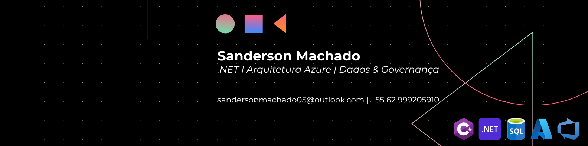

# Sanderson Machado | Nexum

> **Desenvolvedor .NET com base em Engenharia de Software e Governança de TI.**
> Unindo a robustez técnica da Engenharia de Software com as melhores práticas de Governança de TI.

---

### Sobre a Nexum (Conexão & Vínculo)

Atuo na intersecção entre código e resultado de negócio — *Business First, Code Later*. Minha mentalidade é de que o software deve servir à sustentabilidade da organização através de arquiteturas limpas e seguras.

* **Formação:** Ciência da Computação — UniCEUB, 8º semestre (MGA 9.0).
* **Experiência:** Estágio em Desenvolvimento e Governança de TI no DTI (Ministério da Defesa), set/2024 – ago/2026. Desenvolvi sozinho o **PTD** (Plano de Transformação Digital do Ministério), premiado com 🏆 **1º lugar** no Prêmio Destaque em Gestão e Governança 2025 (MGI).
* **Diferencial:** Clean Architecture, DDD, SOLID e documentação de decisões arquiteturais via ADRs.

---

### Radar Tecnológico (Foco Estratégico)

Para garantir a excelência, foco no domínio do ecossistema Enterprise da Microsoft.

| 🟢 ADOPT (Foco Total) | 🟡 ASSESS (Aprendizado) | 🔴 HOLD (Fora de Foco) |
| :--- | :--- | :--- |
| **C#** / **.NET 9** | **Docker & xUnit** | Front-end Complexo |
| **ASP.NET Core Web API** | **Azure Functions** | Linguagens fora do ecossistema MS |
| **SQL Server & EF Core** | **Minimal APIs** | Ferramentas não-Enterprise |
| **Clean Architecture & DDD** | **Certificação AZ-900** | — |

---

### Projetos Nexum (Portfólio)

* **[Vestigia](https://github.com/sandersonnexum/Vestigia):** API de gestão financeira pessoal em .NET 9, com Clean Architecture e DDD, desenvolvida em dupla.
* **Vitalitas** *(repositório privado — Azure DevOps):* sistema de gestão para academias. Atuo como PO e Tech Lead Backend, liderando um time de 6 pessoas. Autenticação via bcrypt + JWT.
* **Clinker Calculus** *(repositório privado — projeto de cliente):* sistema de gestão para a **Clinker Engenharia**, via Cronos Tecnologia. MVP com módulos de login, cadastro de materiais e projetos.

**Outros projetos:** [Organum](https://github.com/sandersonnexum/Organum) (Go · Vue.js · MongoDB) · [Ratio Culinae](https://github.com/sandersonnexum/RC-Android) (Android · Java · IA generativa) · [Apparatus Operandi](https://github.com/sandersonnexum/Apparatus-Operandi) (C++ · Sistemas Operacionais) · [Conclave](https://github.com/sandersonnexum/Conclave-Movie-UX) (HTML · CSS)

---

### Conecte-se com a Nexum

> *"Documentação não é burocracia, é legado. Se não está documentado, não está pronto."*
